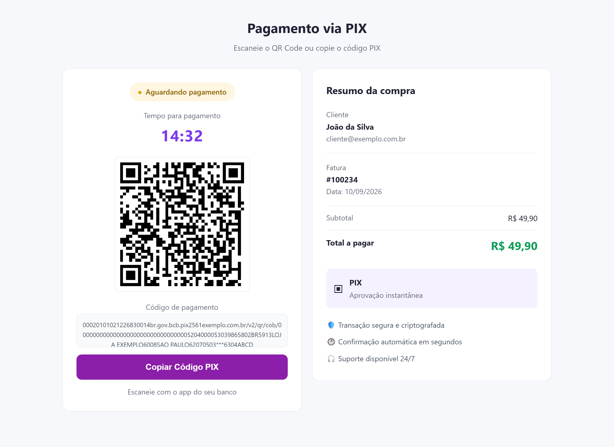
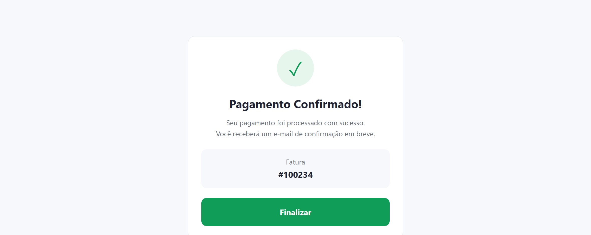
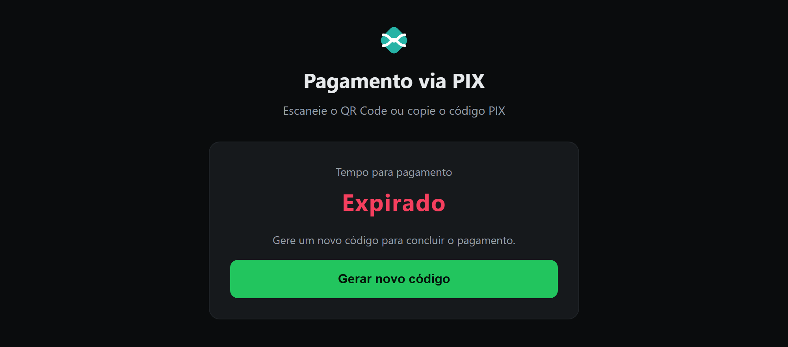
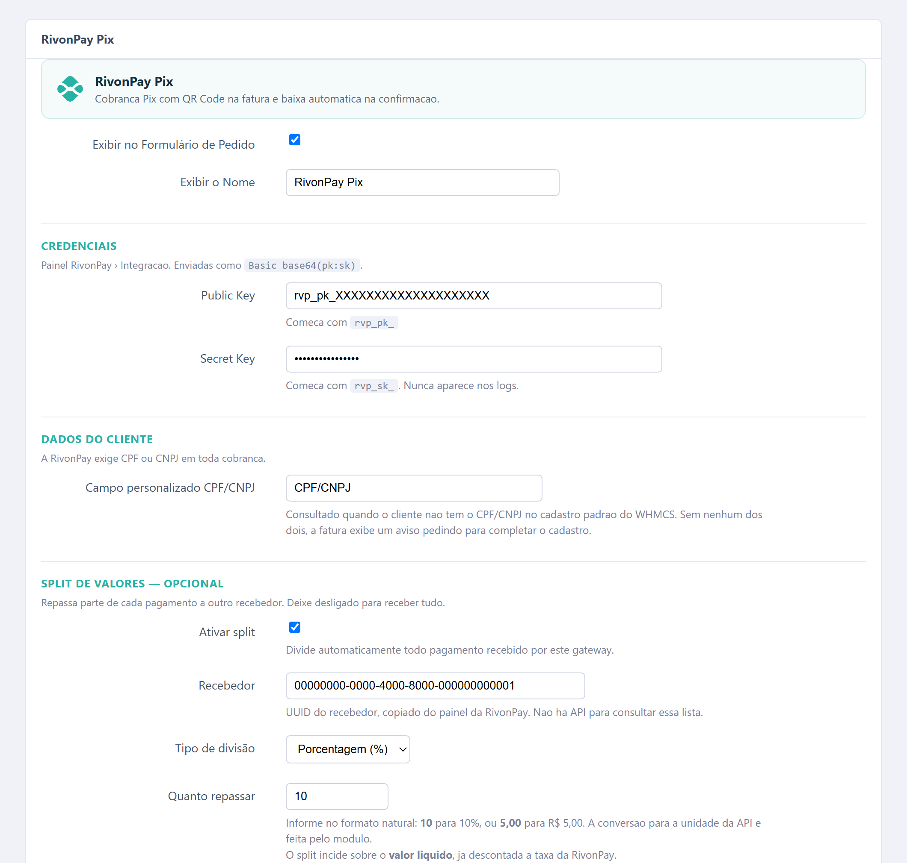

# WHMCS — Módulo de Pix RivonPay

Módulo de pagamento que emite cobranças Pix pela [RivonPay](https://api.rivonpay.com.br),
exibe QR Code e copia-e-cola na fatura e dá baixa automática quando o pagamento
é confirmado. Inclui uma página de pagamento independente do tema, com contagem
regressiva e confirmação em tempo real, acessível por link sem exigir login.

**Versão:** 1.0.0
**Requisitos:** WHMCS 7.x ou superior · PHP 7.4+ com cURL · faturas em BRL
**Sem dependências externas.**

---

## Como funciona

O cliente abre o link e vê o QR Code, o tempo restante e o código copia-e-cola.
A página consulta a API a cada 6 segundos e troca sozinha quando o Pix cai — sem
o cliente precisar atualizar nada.



Confirmado o pagamento, a fatura é baixada no WHMCS e a tela muda:



Se o código expirar sem pagamento, a fatura continua em aberto e nada é cobrado.
O cliente gera um novo código com um clique — a página **não** regenera sozinha,
para que uma aba esquecida aberta não produza uma cobrança nova por hora:



> As imagens acima são renderizadas com dados fictícios a partir do CSS do
> próprio `rivonpix.php`.

---

## Como Instalar

1. Copie o arquivo do gateway para a raiz do WHMCS, preservando o caminho:

   ```
   modules/gateways/rivonpay.php
   ```

2. Copie o arquivo de callback:

   ```
   modules/gateways/callback/rivonpay.php
   ```

3. Copie a página de pagamento para a **raiz** do WHMCS, ao lado do `init.php`:

   ```
   rivonpix.php
   ```

4. *(Opcional)* Copie o hook que envia o link de pagamento nos e-mails de fatura:

   ```
   includes/hooks/rivonpix.php
   ```

5. No admin, vá em **Configurações > Gateways de Pagamento > Todos os Gateways**
   e ative **RivonPay Pix**.

6. Preencha as credenciais, obtidas no painel da RivonPay:

   | Campo | Observação |
   |---|---|
   | Public Key | começa com `rvp_pk_` |
   | Secret Key | começa com `rvp_sk_`; enviada como `Basic base64(pk:sk)` |
   | Campo personalizado CPF/CNPJ | usado quando o cliente não tem `tax_id` |
   | Ativar split | opcional — ver [Split de valores](#split-de-valores) |
   | Log detalhado | ligue durante os testes |

   

   > Prévia dos campos. A moldura exata depende do tema do seu admin.

7. As tabelas `mod_rivonpay` e `mod_rivonpay_links` são criadas automaticamente
   no primeiro uso. Não é necessário rodar SQL.

   > **Atualizando de uma versão anterior:** se já existir uma `mod_rivonpay` com
   > outro layout, o módulo detecta as colunas faltando, preserva a tabela antiga
   > como `mod_rivonpay_legacy_<data>` e recria a atual. A migração aparece no
   > Gateway Log como `migracao-tabela`. Nada é apagado.

8. Não é preciso cadastrar webhook no painel da RivonPay. O módulo envia a
   `postbackUrl` em cada cobrança, montada a partir do System URL do WHMCS:

   ```
   https://SEU_DOMINIO/modules/gateways/callback/rivonpay.php
   ```

9. Se instalou o hook do passo 4, edite o template em **Configurações >
   E-mail Templates** e insira o link de pagamento:

   ```smarty
   {if $rivonpix_link}
     <a href="{$rivonpix_link}">Pagar com Pix</a>
   {/if}
   ```

   A variável fica disponível em *Invoice Created*, *Invoice Payment Reminder* e
   nos três avisos de atraso. Vem vazia se a fatura já estiver paga ou cancelada.

---

## Arquitetura

| Arquivo | Papel |
|---|---|
| `modules/gateways/rivonpay.php` | Configuração, emissão da cobrança e emissão de tokens |
| `modules/gateways/callback/rivonpay.php` | Postback: confirma o pagamento e baixa a fatura |
| `rivonpix.php` | Página de pagamento standalone (raiz do WHMCS) |
| `includes/hooks/rivonpix.php` | Publica `{$rivonpix_link}` nos e-mails de fatura |
| `tests/rivonpay_test.php` | Valida a API isoladamente, sem WHMCS |
| `tests/rivonpay_test.sh` | Mesmo teste em curl, para máquinas sem PHP |
| `docs/API_FINDINGS.md` | **Como a API funciona de verdade** — leia antes de mexer |

A emissão da cobrança vive em uma única função, `rivonpay_charge()`, usada tanto
pela fatura do WHMCS quanto pela página standalone. As duas telas seguem por
construção as mesmas regras de reaproveitamento, valor mínimo e tratamento de erro.

### Requisitos do cliente

A API exige CPF ou CNPJ. O módulo busca, nesta ordem:

1. o campo padrão do WHMCS (`tax_id`);
2. o campo personalizado configurado (padrão: `CPF/CNPJ`).

Sem nenhum dos dois, a fatura mostra um aviso pedindo para completar o cadastro —
não gera erro nem página em branco.

---

## Links de pagamento

O ID da fatura **não aparece na URL**. O que circula é um token aleatório de
256 bits (`random_bytes(32)` em hex), guardado em `mod_rivonpay_links`:

```
https://seu-whmcs.com/rivonpix.php?token=bbb18306d1c3...4bd5e60c
```

Três formas de acesso:

1. **`?token=...`** — qualquer pessoa com o link, sem login;
2. **`?invoiceid=N`** — cliente logado, dono da fatura;
3. **`?invoiceid=N`** — admin logado, para suporte.

O token é emitido **por fatura, não por cobrança**. Cobranças Pix expiram em
cerca de uma hora e são regeradas; um token preso à cobrança viraria link morto
na caixa de entrada do cliente. O token acompanha a fatura e sobrevive a quantas
cobranças forem necessárias.

**Para gerar o link**, logado no painel administrativo, abra:

```
https://seu-whmcs.com/rivonpix.php?invoiceid=177084&link=1
```

A página devolve a URL pronta com botão de copiar. O token é criado na primeira
chamada e reaproveitado nas seguintes, então o link de uma fatura é sempre o mesmo.

Em código:

```php
$url = rivonpay_paymentUrl($invoiceId, getGatewayVariables('rivonpay'));
```

**Para revogar um link**, apague a linha correspondente em `mod_rivonpay_links`.
Os demais continuam valendo, e trocar a secret key do gateway não derruba nenhum.

---

## Split de valores

Opcional e desligado por padrão. Quando ligado, **todo** pagamento recebido por
este gateway repassa uma parte a outro recebedor.

| Campo | O que informar |
|---|---|
| Recebedor | UUID copiado do painel da RivonPay |
| Tipo de divisão | Porcentagem (%) ou Valor fixo (R$) |
| Quanto repassar | `10` para 10%, ou `5,00` para R$ 5,00 |

**Informe no formato natural.** A API espera unidades diferentes conforme o tipo
— centavos para valor fixo, centésimos de por cento para percentual (`1000` =
10%) — e essa conversão é feita pelo módulo. Isso evita o erro de 100× que a
especificação da API não previne: quem manda `10` esperando 10% repassa 0,1% e
recebe `201 Created`, sem erro algum.

**O split incide sobre o líquido,** não sobre o valor da fatura: a taxa da
RivonPay sai antes. Como a taxa é fixa, ela pesa em valores baixos — numa
cobrança de R$ 1,00 o líquido é R$ 0,50, e 10% repassa R$ 0,05.

Configuração inválida (UUID malformado, valor não numérico, percentual acima de
100) **não impede o pagamento**: o módulo registra `split-ignorado` no Gateway
Log e emite a cobrança sem divisão. Dividir errado seria pior que não dividir.

Não há API para consultar recebedores — a lista existe apenas no painel.

## Notas de comportamento

- **Valor em centavos.** `$params['amount']` chega em reais e é convertido. A API
  recusa abaixo de R$ 1,00 (`422 AmountBelowMinimum`); o módulo avisa antes de
  chamar a API.
- **Só BRL.** Faturas em outra moeda exibem aviso.
- **A validade quem define é a plataforma.** O módulo não envia `expiresInSeconds`;
  usa o `pix.expiresAt` da resposta para exibir o vencimento e decidir se a
  cobrança ainda pode ser reaproveitada.
- **Reaproveita a cobrança.** Recarregar a página não gera Pix novo enquanto o
  anterior valer — evita QR duplicado e estouro de rate limit. Há ainda uma trava
  de 180 segundos que reaproveita a cobrança recém-criada mesmo que a leitura do
  vencimento falhe.
- **O auto-reload só liga se a cobrança foi gravada,** e **para no vencimento.**
  Sem isso, uma aba esquecida aberta geraria uma cobrança nova por hora. Falhas de
  gravação aparecem no Gateway Log como `db-insert-FALHOU` e `ensureTable-FALHOU`,
  mesmo com o log detalhado desligado.
- **Código expirado** vira "O código Pix expirou" com botão *Gerar novo código*.
  A fatura continua em aberto e nada é cobrado.
- **`502 AcquirerUnavailable` é transitório.** Acontece quando a adquirente
  oscila. O módulo mostra "tente novamente em instantes" em vez de quebrar a fatura.
- **A baixa nunca confia no postback.** Do POST sai só o ID da transação; o status
  vem sempre de uma reconsulta autenticada à API. **O webhook da RivonPay não é
  assinado** — verificado: nenhum HMAC ou cabeçalho de origem —, então quem
  descobrir a URL do callback pode postar um `transaction.paid` forjado. A
  reconsulta é a única coisa que impede isso de virar fatura baixada sem dinheiro.
- **O webhook dispara na criação e no pagamento.** O evento `transaction.created`
  gera uma entrada no log e nenhuma alteração na fatura — é esperado.
- **Dupla baixa é impossível.** O callback usa `checkCbTransID`, e a página
  standalone confere o `transid` em `tblaccounts` antes de lançar.

---

## Testes

Antes de mexer no WHMCS, valide a API isoladamente:

```bash
cp tests/.env.example tests/.env   # preencha RIVONPAY_PK, RIVONPAY_SK e TEST_DOC_NUMBER
php tests/rivonpay_test.php
```

Em máquinas sem PHP:

```bash
bash tests/rivonpay_test.sh
```

Depois de pagar a cobrança gerada, consulte o status para conferir a transição:

```bash
php tests/rivonpay_test.php <id-da-transacao>
```

O script distingue erro de credencial de erro de negócio: HTTP 401 em todos os
modos significa chave errada; qualquer outro código significa que a autenticação
passou e o problema é outro.

> `tests/.env` está no `.gitignore`. Nunca versione chaves.

No WHMCS, com o log detalhado ligado, acompanhe em
**Utilitários > Logs > Gateway Log**.

---

## Suporte

Questões técnicas e relatos de erro: abra uma issue neste repositório.

Problemas com a conta, KYC ou a adquirente são da RivonPay — ao acionar o suporte
deles, informe o `code` e o `details` que aparecem no Gateway Log, além do horário
da tentativa.

---

## Changelog

### 1.0.0 — 2026-09-11

Primeira versão.

- Emissão de cobrança Pix via `POST /v1/transactions/`, com QR Code e
  copia-e-cola na fatura do WHMCS.
- Baixa automática por postback, com reconsulta obrigatória à API.
- Página de pagamento standalone (`rivonpix.php`) com contagem regressiva,
  confirmação em tempo real e tela de pagamento confirmado.
- Links de pagamento por token aleatório de 256 bits, por fatura, revogáveis
  individualmente.
- Hook de e-mail publicando `{$rivonpix_link}` nos templates de cobrança.
- Reaproveitamento de cobrança vigente, com trava contra criação em rajada.
- Migração automática de instalações com `mod_rivonpay` em layout antigo.
- `docs/API_FINDINGS.md` com a API mapeada a partir do `openapi.json` e validada
  contra a API real: autenticação, campos obrigatórios, formato de resposta,
  taxonomia de erros e ciclo de status.

---

## Licença

Uso interno. Todos os direitos reservados.
